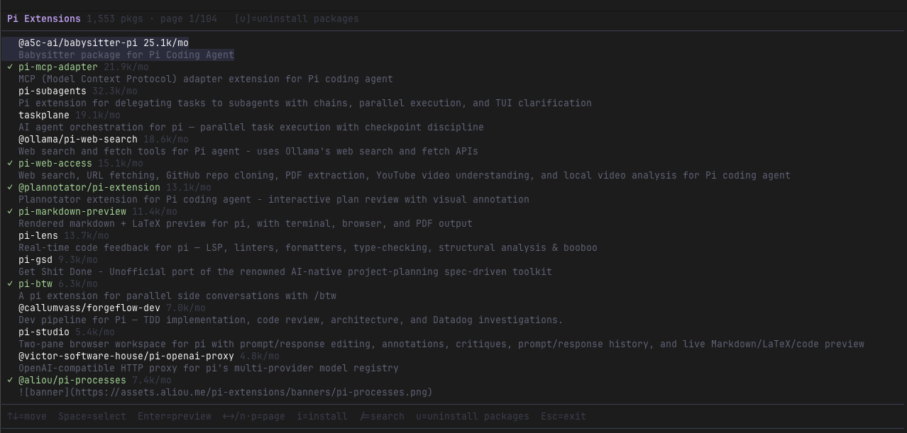

# pi-extension-installer

Browse and install Pi community packages from within pi — an interactive TUI extension browser with arrow-key navigation, search, previews, and uninstall support.



## Install

```bash
pi install npm:pi-extension-installer
```

Then `/reload` to activate, and use `/extensions` to open the browser.

## Usage

Run `/extensions` in pi to open the browser.

### Browse view

| Key | Action |
|-----|--------|
| `↑` / `↓` | Move cursor |
| `←` / `→` or `n` / `p` | Previous / next page |
| `Space` | Toggle select package |
| `Enter` | Preview readme + links; press `Enter` again in preview to install |
| `i` | Install selected (or cursor package if none selected) |
| `/` | Search packages |
| `u` | Switch to Manage Installed view |
| `Esc` | Exit |

### Manage Installed view

| Key | Action |
|-----|--------|
| `↑` / `↓` | Move cursor |
| `Space` | Toggle select for removal |
| `Enter` | Uninstall selected (or cursor package if none selected) |
| `u` / `Esc` | Back to browse |

## How it works

- Searches the npm registry for packages tagged `pi-package`
- Install: runs `npm install -g <pkg>` and registers the package in `~/.pi/agent/settings.json`
- Uninstall: runs `npm uninstall -g <pkg>` and removes from `settings.json`
- Already-installed packages are detected and skipped (avoids macOS ENOTEMPTY rename errors)
- Run `/reload` after installing or uninstalling to apply changes

## Requirements

- [pi coding agent](https://github.com/badlogic/pi-mono) ≥ 0.68.0
- Node.js ≥ 18
